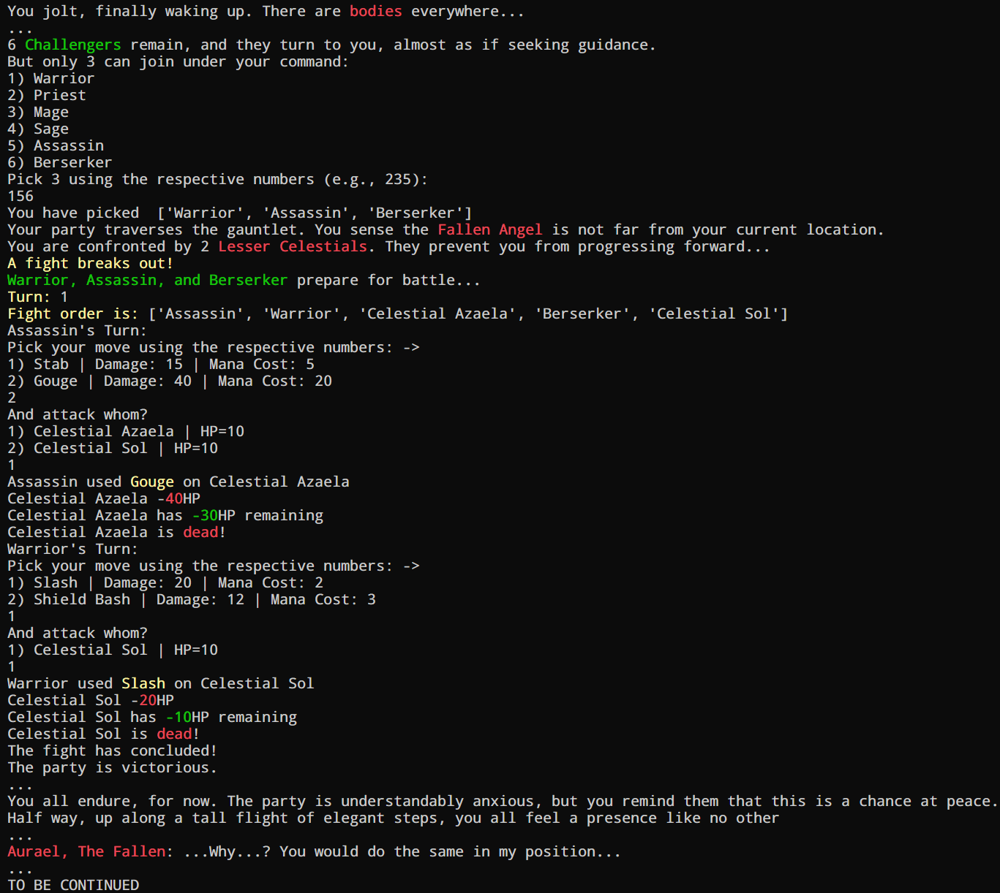

# trial_by_three_RPG
CLI turn-based, party-based 'dungeon crawler'. With some half-baked rougelite elements

Idea is to pick 3 out of 6 potential heroes (which havent even been decided yet**), fight through a warm-up battle. And if you win, fight the main boss, name pending. Probably "Fallen Angel, Aurael", since Dragon/Dragon Lords are very overdone...

Follows an agility/speed/initiative system, so after each choice is made (3 for your entire team), the full turn is played out***. Your fastest units will always play first, and the enemy somewhere in-between/before everyone/after everyone

** old message, still undecided
<br>
*** old message, currently doesnt do this, and maybe never will

### Note
- Purely as an laid-back excercise for the Python + OOP part of boot.devs DevOps Engineer path (so I can submit it for 'Personal Project 1: Lesson 4')
- although this is to fulfil boot.devs "Personal Project 1", this is not my first independent project. and I was also in a rush so it doesnt have the usual amount of love put into it as I would like (as is with this README...) :(
- objective: cement the python I've been learning in an entirely unstructured project i.e., there was no guidance or help given
- if you're a industry professional, my current main portfolio piece is [tweakforge.tools](https://tweakforge.tools) (I also didnt want to submit that since that's cheating and something Ive spend much, much more than 20-40 hours on...). See the [tweakforge.tools README](https://github.com/Deen-q/tweakforge) here
<br>

## Preview/spoilers:
<p align="center">

</p>

Likely will not recieve any more updates, lots of other things to focus on

## If you want to run it for yourself
1. clone it down:
```
git clone https://github.com/Deen-q/trial_by_three_RPG.git
```
2. `cd` to its location:
3. run:
```
python3 main.py
```

I used Python 3.12.3